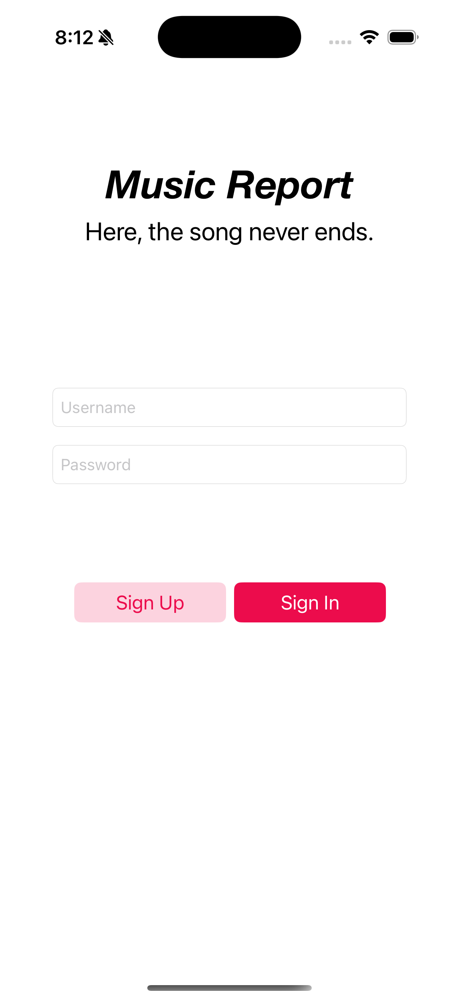
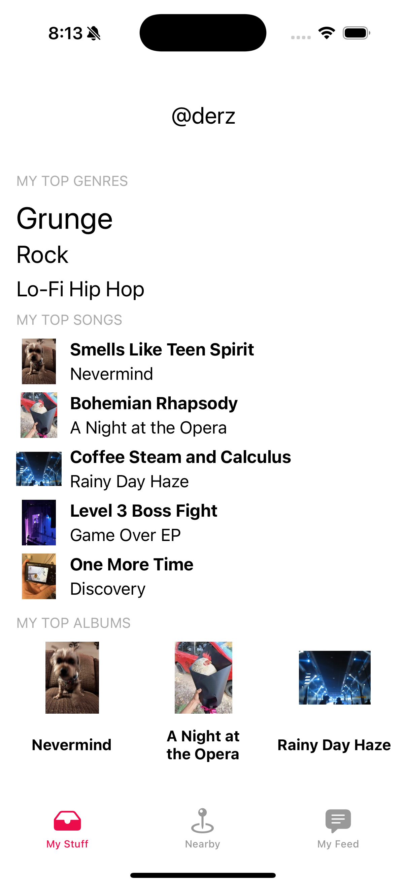
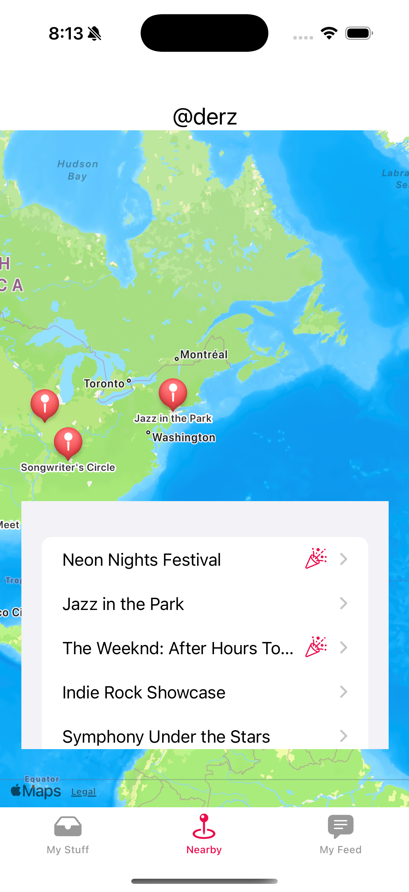
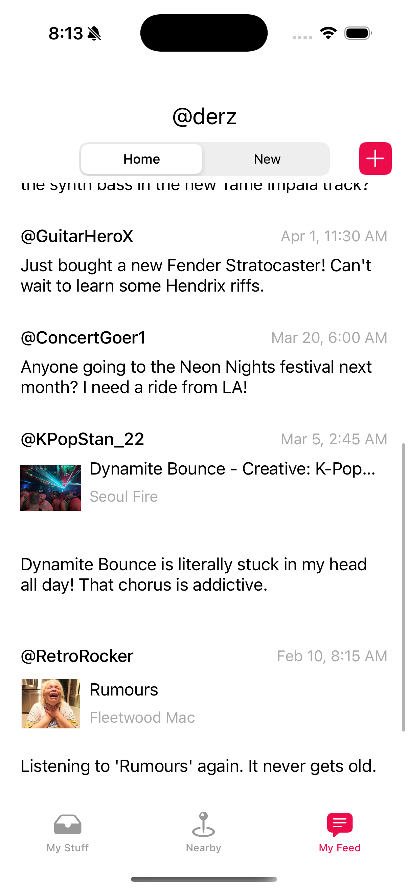
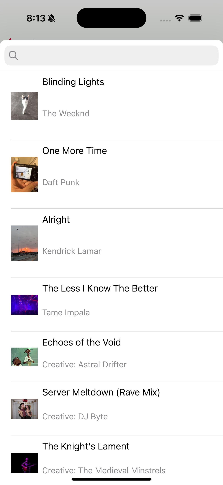

# Music Report

**Music Report** is an iOS social app that lets users share their musical journey with friends who get it. Favorite songs, albums, and live events become conversation starters, helping users connect through the universal language of music.

> _This project was created as part of **Mobile Programming 3326 (Fall 2025)** at **St. Edward’s University**._

## Overview

**Music Report** allows users to build a personal music library, share posts centered around music, and discover what others are listening to. The app blends social interaction, music discovery, and local live event exploration into a single experience.

A user’s musical identity updates in real time as they interact with songs, albums, and events—turning listening habits into something social and shareable.

## Features

- **Personal Music Library**
  - Track favorite songs, albums, and genres
  - View top genres and most-played tracks at a glance

- **Social Feed**
  - **Home Feed:** Posts related to music already in your library
  - **New Feed:** Discover music your friends are listening to
  - Posts can include:
    - Songs or albums (with artwork and artist details)
    - Text-only posts

- **Live Events Map**
  - Interactive map displaying concerts, festivals, and local shows
  - “Hot” events are highlighted for visibility
  - Event detail pages include venue, date, and ticket links

- **Posting & Sharing**
  - Create posts with text and optional music attachments
  - Music picker allows searching through your personal library

- **Accounts & Security**
  - Secure account creation with password requirements
  - Persistent user profiles with post history

## Screenshots

  
  
  
  
  

## How to Run

1. Clone this repository
2. Open `MusicReport.xcodeproj` in Xcode
3. Select an iOS Simulator (e.g., **iPhone 15**)
4. Press ▶ **Run**

### Requirements

- macOS
- Xcode 15 or newer
- iOS 17+ Simulator

If the project does not build immediately, resolve Swift Package Manager dependencies:

Xcode → File → Packages → Resolve Package Versions

## Tech Stack

- **Language:** Swift
- **UI Framework:** UIKit
- **Architecture:** MVC (Model–View–Controller)
- **UI Components:**
  - Dynamic `UITableView` with reusable cells
  - Auto Layout / Auto Constraints
- **Persistence:** Core Data
- **Maps & Location:** MapKit
- **Navigation:** `UINavigationController`

## What I Learned

- Building a multi-screen iOS application using UIKit and MVC
- Implementing dynamic table views backed by persistent data
- Using Core Data for local storage and managing fetch requests
- Designing responsive layouts with Auto Layout constraints
- Integrating MapKit for location-based features
- Managing navigation and data flow between view controllers

## Notes

This project was built for academic purposes and is not currently published on the App Store. The repository is intended to showcase iOS development skills, architecture, and UI design rather than production deployment.
